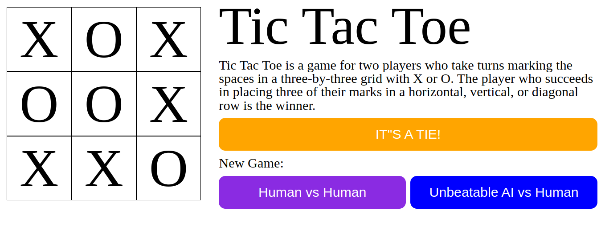
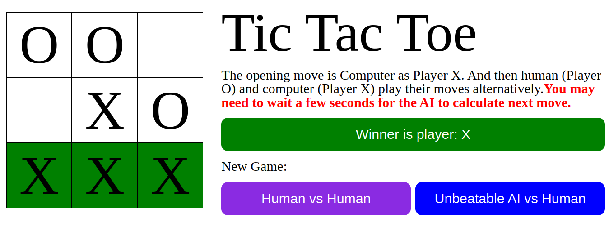

# Odin-Tic_Tac_Toe

[Task Description](https://www.theodinproject.com/lessons/node-path-javascript-tic-tac-toe)

[Live preview](https://maxim55069633.github.io/9.odin_Tic_Tac_Toe/)

In this project, I create an interactive game Tic Tac Toe. I implement the concepts of "Factory Function" and "The Module Pattern" to use the global variables as little as possible. 

I learn:

1. Reload a page.
2. Make use of array filter.
3. Understand I should duplicate an array when it works as an argument to be passed to a function.
4. Apply minimax algorithm to create an unbeatable AI [This video helps a lot](https://www.youtube.com/watch?v=P2TcQ3h0ipQ)

Screenshot:
1. 

2. 

